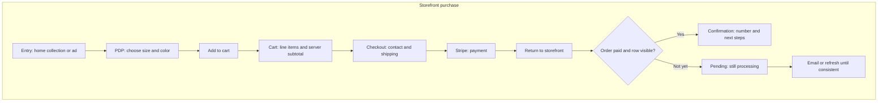
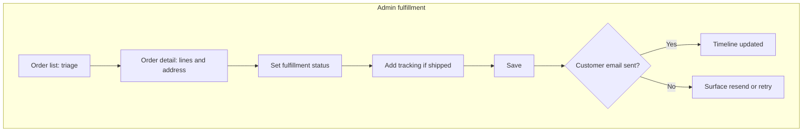

---
stepsCompleted:
  - 1
  - 2
  - 3
  - 4
  - 5
  - 6
  - 7
  - 8
  - 9
  - 10
  - 11
  - 12
  - 13
  - 14
lastStep: 14
inputDocuments:
  - _bmad-output/planning-artifacts/zephyr-lux-commerce-prd.md
  - _bmad-output/planning-artifacts/epics.md
  - _bmad-output/planning-artifacts/architecture.md
  - _bmad-output/planning-artifacts/implementation-readiness-report-2026-04-25.md
---

# UX Design Specification zephyr-lux-react

**Author:** Raminallazov
**Date:** 2026-04-25

---

<!-- UX design content will be appended sequentially through collaborative workflow steps -->

## Executive Summary

### Project Vision

Zephyr Lux’s direct storefront should read as a **premium, single-brand D2C** experience: the **decision to buy** (variant, price, fit, and trust) leads; checkout stays **calm and legible**; the owner path stays **operational and honest**—clear money, address, and fulfillment state, with **reconciliation** when the real world and the app disagree. The system replaces a generic multi-tenant merchant stack with **one** inventory, **one** brand, and **one** operator’s mental model: **trust** on the customer side, **certainty and speed** on the admin side, and **integrity** of order and catalog data (no divergent “sources of truth” across list, detail, cart, and payment). In short: **decisive comfort**—shoppers know what they are getting, when it ships, and what happens if something is off; the owner always has **one clear next action** when the system hiccups.

### Target Users

- **Shoppers (primary):** Often on **phone**, from social, search, or direct links. They need **one mental model** for **variant, stock, and price**; **frictionless** cart edits; and **no surprise** totals or dead-end checkout. Post-purchase, they need **credible** confirmation and, when shipped, **tracking** in plain language. **“What is true after I pay?”** (pending confirmation, paid, processing, shipped, delayed) must be a designed story—not only a success screen. Guest checkout can stay default; **returning to the order** via email or lookup matters more than accounts on day one.
- **Store owner / operator (primary):** Treats admin as a **fulfillment and reconciliation** tool. They need **at-a-glance** new paid work, a **copy/print-friendly** ship-to block, **one-step** status moves with guardrails, **internal notes** and a **timeline**, and **visible** health when email or webhooks misfire—without assuming a helpdesk. **Mobile** use for triage and mark-shipped is a **floor**, not a future polish.
- **Reconciliation and support (implicit stakeholders):** Even when the same person wears multiple hats, the experience should reflect **dollar and inventory truth** (fewer chargebacks and support loops), and a path for **support-style** issues—wrong line, stuck pay, duplicate anxiety—so “failure visibility” is not only **developer** visibility.
- **Ops / pack-ship (near-term):** Physical fulfillment and returns are **brand and conversion** risks, not only a later “helper” role; flows should leave room for **pick/pack/ship** clarity and return paths without overbuilding the MVP.
- **Returning customers and future fulfillment helpers:** Reorder, order lookup, and restricted roles land after the **browse → pay → fulfill** spine is real; the UX should not block those routes when they are added.

### Key Design Challenges

- **Variant-led commerce:** Unify **selection → price → add to cart** so ambiguity, OOS, and stale cart items feel **informed**, not broken; align with a single **inventory/checkout semantics** model (e.g. block at pay vs post-pay adjustment) so APIs and copy stay stable.
- **Asynchronous truth:** The SPA, Stripe, and webhooks are **eventually consistent**. UX must express **status layers** (intent → server accepted → payment confirmed → order recorded → fulfillment)—especially “**paid but not yet confirmed**” and recovery—without **two competing stories** on the customer vs operator side.
- **Two tempos, one system:** An **editorial, calm** storefront and a **utilitarian, high-signal** admin (including ~320px–390px) without two unrelated visual languages; **accessibility** (keyboard, labels, contrast) is part of the **component strategy**, not a late audit.
- **Trust without clutter:** **Shipping, returns, fit, and support** must read as **considered** (especially on mobile), not a wall of banners; **sensory, honest** product copy and imagery should support the **decision**, not outrank variant clarity.
- **Resilience as product:** Explicit patterns for **payment failure/cancel**, **stale/invalid cart**, **confirmation** when opened cold, and **operator-side** notification or pipeline failure—MVP can scope **how loud** the UI is, but must not **hide** paid orders or unrecoverable states.
- **Data and money risk (brownfield → target):** Legacy gaps (fragmented catalog, product-id cart, public order storage) are **revenue, privacy, and compliance** risks, not only tech debt; the UX spec aligns with a move to a **single canonical catalog** and **non-public** order of record.

### Design Opportunities

- **Gallery and material truth:** **Large, performant** imagery and **structured** fabric, care, and fit—**LCP- and a11y-aware**—so “premium” is **credible and fast**, not only pretty.
- **“Operator calm” as a feature:** Triage-first order list, **unfulfilled** focus, and **actionable** integration health (e.g. notification or webhook issues) so the owner is never **only** relying on inbox zero.
- **Systematic empty/error/loading design:** **First-class** states across storefront, cart, checkout, confirmation, and admin (per PRD and epics) to avoid **edge-state** rework called out in implementation readiness.
- **Guest-first, account-ready:** **Low-friction first purchase** and a **credible** path back to the order; accounts and subscriptions **attach** when the product earns repeat behavior.
- **One reconciliation narrative:** Customer “where is my order?” and admin “what did we promise?” should **feel like the same order story** end to end.

## Core User Experience

### Defining Experience

The product’s **core loop** is **select variant → confirm price and availability → add to cart → check out with server-authoritative totals → land in a true order state** (with email and admin aligned to **webhook-backed** payment reality). The **highest-frequency** action for customers is **browse and decide on a product page**; the **must-not-fail** action is **checkout that matches catalog and Stripe** and **order confirmation** that does not lie when processing is still in flight.

For the **owner**, the core loop is **see a new paid order → ship from accurate address and line items → mark fulfillment and, when applicable, add tracking**—ideally in **one short session on a phone** without a separate ops tool.

If we get **variant, pay, and one order truth** right, the rest of the roadmap (policies, collections, lookup, PWA) attaches without renegotiating the mental model.

### Platform Strategy

- **Primary platform:** **Responsive web** (React SPA on Vercel)—**one** app for storefront and `/admin`, not separate native clients for MVP.
- **Input modalities:** **Touch-primary** for shoppers; **mouse/keyboard** supported; **keyboard operability** for core customer and essential admin actions (NFR).
- **Viewports:** Design **mobile-first** for the storefront (**320px+** per PRD); admin must be **usable on small phones** (architecture: ~390px) for list, detail, and ship, not only desktop.
- **Payment surface:** **Stripe** (Checkout Session and/or **Payment Element**—product and architecture lock). Browser sees **publishable** keys only; all sensitive paths stay server-side.
- **Offline / PWA:** **No** offline purchase path in MVP; **PWA-readiness** is a **non-blocking** future alignment (installability, service worker) after the core web flows are solid.
- **Device capabilities to plan for (later PWA phases):** **Camera** for shipment and label images; not a blocker to **mark shipped** and **type tracking** on mobile web first.

### Effortless Interactions

- **Variant selection** that **always** ties **price, OOS, and add-to-cart** together—no “selected but wrong price” or **silent** OOS.
- **Cart** that **remembers** and **reconciles** to current catalog; **stale items** are explained and fixable in **one** place.
- **Checkout** with **visible** required fields, **actionable** validation, and **totals** that match what the server will charge—**no** disabled pay without a **plain-language** reason.
- **Post-payment:** Clear **“what happens next”** and **asynchronous** states (for example still confirming) without panic copy.
- **Admin:** **New paid / needs fulfillment** is obvious; **address copy** is one gesture; **status** moves with **sane defaults** and **clear** error when an integration step fails.
- **Automatic where safe:** Persist cart, recover session after Stripe **return** without losing the basket, **refresh** order state from server on confirmation and admin—not **optimistic** money without a **server-true** backstop.

### Critical Success Moments

- **“I trust this enough to pay”** — product page, totals, and policies and signals feel **coherent** on a **small screen**.
- **“My order is the same in email, on screen, and in admin”** — no **split** reality between **success UI** and **paid/fulfillment** state.
- **“The owner is not surprised by a paid order”** — **notification path** and **in-app list** make **new money** **visible and actionable** (even if **notification** plumbing is still hardening; **data** is never hidden).
- **First-time path:** **First** purchase and **first** admin ship both complete **without** **placeholder** or **broken** links in the **main** path.
- **Make-or-break flows:** **PDP** → **cart** → **checkout** → **order confirmation**; **admin order list** → **detail** → **shipped** and **tracking**; **failure** paths (**pay fail, cancel, stale cart**) must not **strand** the user or **lose** a paid order.

### Experience Principles

1. **One truth, many surfaces** — Shoppers, emails, and admin show **one** order story; **async** steps are **labeled**, not **papered over**.
2. **Variant is the product** — The **purchasable unit** is **SKU/variant**; the UI and cart never **pretend** a **product** is enough.
3. **Calm at money** — Checkout and pay states are **legible** and **forgiving**; **panic** and **jargon** are for logs, not customers.
4. **Operator speed over chrome** — Admin is **dense in signal**, **sparse in** decoration; **touch** and **copy** are **first-class**.
5. **Mobile is the default** — If it fails at **320px** on the **store** or on a **phone admin**, it is not **done**.
6. **A11y is a build constraint** — **Headless**, **accessible** primitives for inputs, **dialogs**, and **selectors**; no **one-off** **invisible** form fields.
7. **Explicit beats clever** — **Empty, error, loading, and** “**still processing**” are **designed** states, not **whitespace**.
8. **Spare UI for the brand** — **Premium** means **clarity and material honesty**, not **ornament** that **hides** **variant** and **fulfillment** facts.

## Desired Emotional Response

### Primary Emotional Goals

- **Shoppers — calm confidence** — They should feel **clear about what they are buying** (variant, feel, care, policy), **unsurprised at pay**, and **reassured after pay** (including when confirmation is **briefly** asynchronous). The dominant feeling is **“this is a real store”**, not a **gamified** or **noisy** experience.
- **Owner — composed control** — The operator should feel **on top of the queue** (“I see the money I need to act on”) and **able to act from a phone** without **cognitive overload**. The dominant feeling is **competent and covered**, not **monitoring a fragile script**.
- **Brand — quiet premium** — The storefront should feel **tactile and intentional** (material, care, photography) with **restraint**—**quality** is expressed through **clarity and honesty**, not **flash**.

### Emotional Journey Mapping

| Stage | Intended feeling | Notes |
| --- | --- | --- |
| **Land / discover** (home, collection, ad arrival) | **Curiosity, orientation** — *what this brand sells* and *where to go next* without placeholder noise | Hero and nav set **taste**; do not outrank **path to product** |
| **Product decision** (PDP) | **Clarity, sensory trust** — enough **detail** to choose **size/color** with **confidence** | Pair **sensation** and **logistics** (fit, return, ship) as **reassuring**, not **legal** only |
| **Cart** | **Lightweight control** — easy edits, **no math anxiety** | Stale or invalid items feel **workable**, not **punitive** |
| **Checkout / pay** | **Calm focus** — **orderly** steps, **visible** fields, **no** mystery disabled buttons | If leaving for Stripe, **expectations before leave** and **return** to a **known** state |
| **After pay / confirmation** | **Relief and certainty** — **order #**, **next step**, and **async** “still confirming” is **adult and honest** | **Same story** in email and on screen when possible |
| **Shipping / post-purchase** (email, later lookup) | **Informed patience** — **where it is** and **when to worry** (support path) | **Anxiety** is addressed with **prose**, not **hiding** state |
| **Admin — list** | **Triage, momentum** — **unfulfilled** and **new** read as **one glance** | Optional **nudge** for integration/notification issues without **alarm** fatigue |
| **Admin — order detail** | **Precision, low drama** — **address** and **line items** feel **reliable**; **ship** and **track** are **satisfying** to complete | Failures: **actionable** concern, not **shame** |
| **When something goes wrong** (pay fail, OOS, webhook delay) | **Informed, not abandoned** — user knows **what failed**, **what is safe to retry**, and **where to get help** | Avoid **blamey** or **cute** error copy; **concrete** next steps |
| **Return visit** (repeat buy, order lookup) | **Familiarity without lock-in** — **recognized** and **low-friction**; no **forced** account for **dignity** | Guest-friendly **wins**; account is **upside** later |

### Micro-Emotions

**Prioritize (positive end):**

- **Trust** over **skepticism** at the **totals and pay** line — earned through **consistency** and **plain language**, not **badges alone**.
- **Clarity** over **cleverness** in **forms** and **variant** UI.
- **Accomplishment** over **relief** when the **order** is **placed** — the flow should feel **intentional**, not **lucky to get through**.

**Constrain (avoid):**

- **Anxiety** from **hidden** validation, **silent** OOS, or **ambiguous** post-pay state.
- **Shame** or **vagueness** in **errors** (“something went wrong” with **no** path).
- **Hustle** or **SaaS dashboard** energy on **customer** pages; **bombast** in “luxury” that **masks** **facts**.

**If delight appears:** Prefer **delight in craft** (typography, imagery, **micro** motion on **load/success**), not **gimmicks** that **compete** with **variant and price**.

### Design Implications

- **Calm** → **Generous** spacing at **pay**, **progressive** disclosure of **legal** and **secondary** detail; **one** strong **next action** at a time where possible.
- **Trust** → **Consistent** **order** **identity** (number, line items) across **screen, email,** and **admin**; **no** **divergent** “success” stories.
- **Composure (owner)** → **Triage** **visuals** (sort, **badges** that **encode** state, not **decoration**); **inline** **recovery** for **failed** **notification** (even if **MVP** is **lean** on **automation**).
- **Tactile premium (brand)** → **Image** and **copy** that answer **“how it feels to own”**; **restraint** in **layout** and **animation** so **content** **carries** mood.
- **Resilience without panic** → **Failure** and **empty** states with **reassuring** **tone** and **clear** **verbs** (retry, edit cart, contact).
- **Accessibility as emotional** — **Inclusion** and **control** (keyboard, labels, focus) are part of **respect**, not a **separate** checklist.

### Emotional Design Principles

1. **Calm is the premium** — **Restraint** in **UI noise**; **effort** goes to **clarity** at **decision and pay**.
2. **Honesty is reassuring** — **Asynchronous** and **OOS** truth told **plainly** beats **false** **instant** certainty.
3. **Respect the buyer’s time** — **Short** paths, **sensible** defaults, **no** **dark** patterns; **free** the **cognitive** budget for **product** choice.
4. **The owner deserves peace of mind** — **Operability** and **visibility** of **work** and **risk**; **alerts** are **proportional** and **actionable**.
5. **Brand warmth through material truth** — **Comfort** is shown in **texture, care,** and **fulfillment** promises, not **generic** “luxury” adjectives.
6. **When in doubt, steady** — under **load** or **error**, **stabilize** the **user** with **structure** and **next** steps before **flair**.

## UX Pattern Analysis & Inspiration

### Inspiring products analysis

*Stakeholder input: you have not yet named 2–3 “always open” reference apps. The following uses **public D2C, payments, and ops** pattern language and **should be updated** with your specific favorites (and what you value in each) when ready.*

| Reference / category | What they do well (UX) | Relevance to Zephyr Lux |
| --- | --- | --- |
| **Premium D2C / essentials brands** (e.g. many mattress, apparel, and home “direct” sites) | **Large product imagery**, **scannable** specs, **editorial** restraint, **fit/care/returns** near the **decision** | Aligns with **product-first** storefront and **tactile** brand |
| **Apple-style product** pages (pattern, not 1:1) | **One primary** story, **hierarchy** that doesn’t **fight** the product, **calm** motion | Informs **clarity** and **calm** over **noise**; avoid literal Apple chrome |
| **Stripe Checkout**-class flows (hosted) | **Trust** at pay, **clear** line items, **familiar** pay steps, **obvious** return to merchant | Direct input to **Q1 (hosted vs embedded)**: if hosted, **own** the **before/after** **handoff** in **your** UI copy and layout |
| **Small-merchant / seller hubs** (e.g. Etsy, Shopify, Amazon **Seller**-style **work queues** — *pattern* only) | **Triage** lists, **unfulfilled** as **work**, **order detail** as **one place to act** | Informs **admin** **density**, **status**, and **address copy**; **not** the **full** Shopify **SaaS** visual language on the **store** |
| **“Speed-first”** tools (e.g. **Superhuman, Linear** — *analogy for interaction*, not product domain) | **Keyboard**, **obvious** next action, **low decoration**, **error** you can **act on** | Informs **operator** experience: **fast**, **boring** where **boring** **helps** |

**Core takeaways to steal**

- **Problem solved elegantly (D2C):** “Help me **choose a variant** and **trust** the total **before** I leave.”
- **Navigation / hierarchy:** **Shallow** paths to **buy**; **legal** and **long** text **deferred** or **collapsed**; **primary** CTA always **obvious** on PDP and cart.
- **Delightful (appropriate):** **Image** quality, **type**, **micro** success on **add** and **order placed**—not **games** in checkout.
- **Edge cases / errors (best in class):** **Human** sentences, **retry** and **edit cart** paths, **no** false **success** on money.

### Transferable UX patterns

**Navigation**

- **Primary nav as “three things”** — **Shop** (or collections), **About/trust** as needed, **Cart**; **no** **placeholder** **Account/Search** until real (per PRD).
- **Breadcrumbs** on PDP where **depth** grows later; keep **MVP** **flat** enough to **not** need deep trees.

**Interaction**

- **Variant matrix clarity** — **Size** and **color** as **first-class** controls with **synchronized** **price, OOS,** and **ATC** (disabled **with reason**).
- **Sticky decision zone on mobile** — **ATC** and **key** **variant** state **in thumb reach** on PDP.
- **Cart as honest ledger** — line **identity** by **variant**, **quantity** with **max** tied to **stock**, **stale** lines **fixable** inline.
- **Checkout** — **visible** field-level **errors**; **pay** only when **valid**; **return** from Stripe to **rehydrate** **session** without **losing** cart.
- **Confirmation** — **order number** and **“what’s next”**; **optional** “still confirming” **without** **panic**.
- **Admin** — **sort/filter** for **unfulfilled**; **row** state **badges**; **detail** as **one** **scannable** **ship** block.

**Visual**

- **Plenty of white (or off-white) space** at pay and on PDP; **contrast** for **type** and **CTAs** (NFR + emotional goals).
- **Image aspect** and **grid** that **LCP-**sane (architecture), not **full-bleed** everywhere.

**Which resonate most (default proposal):** **Variant-led PDP**, **honest cart**, **Stripe handoff** done **on-brand**, **triage** admin, **restraint** in **decoration**.

### Anti-patterns to avoid

- **Mystery meat checkout** — **hidden** or **unlabelled** fields, **disabled** pay **with no** reason (brownfield callout).
- **Product-id** mental model in UI — any flow that **lets** the user “buy a product” **without** a **real** **variant** choice.
- **Client-priced** or **client-only** “success” — UI that **asserts** **paid/fulfilled** before **server/webhook** truth.
- **Marketplace** **density** on the **store** — **banners,** **cross-sell** noise, and **SaaS** **widgets** on **customer** pages.
- **Placeholder** **nav** (search, account, policy) in the **core** path (PRD).
- **Cute** or **vague** **errors** on **money** and **fulfillment** — **worse** than **plain** and **actionable**.

### Design inspiration strategy

**Adopt**

- **Image-forward PDP** and **one clear** **primary** CTA per view.
- **Mobile-first** **thumb** affordances on PDP and cart.
- **Order** and **line-item** **truth** that **match** **email,** **UI,** and **admin**.
- **Triage** **admin** list with **at-a-glance** **fulfillment** and **optional** **integration** health.
- **Accessible** form and **dialog** primitives (architecture): **one** system for **store** and **admin** inputs.

**Adapt**

- **Hosted Stripe** — if chosen: **wrap** the **journey** (cart summary, **policy** links, **expect** **redirect**) so the **handoff** **feels** **Zephyr**, not **generic**.
- **“Seller hub”** patterns — take **triage** and **detail** **clarity**; **strip** **platform** **chrome** and **ads**.

**Avoid**

- **Rebuilding** **Shopify**-scale **merchandising** in **MVP** (scope cut).
- **Inconsistent** **empty/error** — **treat** as **first-class** (readiness + PRD).
- **Premature** **delight** that **hides** **variant,** **totals,** or **OOS** state.

*Optional follow-up: name **2–3** apps you want **Zephyr Lux** to feel like (store + admin) and we can **tighten** this section in a quick **pass**.*

## Design System Foundation

### 1.1 Design system choice

**Primary approach:** **Tailwind CSS (existing) + headless accessible UI, implemented with shadcn/ui (Radix primitives).**

This is a **themeable, own-your-source** model: **accessible** building blocks, added into the repo as **local** components (not an opaque all-in-one kit you cannot own), with **design tokens** driven by **Tailwind** `theme` extension and **shadcn**’s **CSS variables**.

**Not selected as the primary path**

- **Fully custom** primitives from scratch — high **accessibility** and **maintenance** cost; conflicts with NFR and architecture without a **dedicated** long-term investment in the full control layer.
- **A heavy, opinionated kit** (e.g. default **Material** as the **storefront** skin) — fast for dense apps but **expensive** to bend into a **calm, bespoke** D2C brand.
- **Ad hoc** hand-rolled **inputs, dialogs, and menus** for checkout and admin — **fails** the architecture bar for **keyboard**, **ARIA**, and **states**.

**Alignment:** The architecture document explicitly allows **Radix / shadcn/ui / Headless UI**. For **Vite + React + TypeScript + Tailwind** in this repo, **shadcn/ui** is the **default** because it **ships** a **proven** **Radix + Tailwind** integration and **unifies** storefront and **/admin** on **one** **family** of **forms, overlays, and** **lists**.

### Rationale for selection

- **Meets the accessibility constraint** as architecture and NFR define it: **semantics, keyboard, and visible** validation for **order-critical** flows.
- **Fits the brownfield** — extends **Tailwind** instead of introducing a second styling **paradigm** for new work.
- **One system, two modes** — **spacious, editorial** customer UI and **tighter, neutral** **operator** UI via **theming** and **wrappers**, not a second UI framework.
- **Form-heavy domains** — checkout, address entry, and fulfillment admin benefit from **standardized** **validation** and **error** **patterns** out of the box.
- **Test and change friendly** — predictable focus and **roles** for **E2E** and **a11y** **regression** on **ATC, pay, and ship**.

### Implementation approach

1. **Stack** — Keep **Vite, React, TypeScript, and Tailwind**; add **shadcn/ui** with a **Vite-appropriate** `components.json` and path aliases (e.g. `@/components/ui`).
2. **Add components on demand** — e.g. **Button, Input, Label, Form, Select, Dialog, Sheet, DropdownMenu, Tabs,** **Table, Toast, Skeleton, Separator, ScrollArea** as each screen **needs**; avoid **bulk-adding** unused primitives.
3. **Token mapping** — Connect **shadcn** **CSS** variables to **Tailwind** so **one** palette, **radius,** and **typography** scale **drive** both **store** and **admin** (with **mode-specific** **defaults** where useful).
4. **Commerce compositions** — Build **ProductCard,** **VariantSelector,** **price and availability,** **cart** **lines,** **order** **rows,** **status** **badges,** and **address** / **ship** **blocks** as **compositions** on top of **ui** primitives; follow the **image/LCP** strategy from **architecture** for **galleries** (lazy, sizes, or a **single** **carousel** **abstraction** as decided in **engineering**).
5. **Icons** — **lucide-react** (shadcn default) or **one** **agreed** **icon** set for the whole app.
6. **No invisible checkout fields** — align **forms** to **NFR** and **PRD** (brownfield **fix**): **labelled** **inputs**, **visible** **errors**, no **mystery** **disabled** pay.

### Customization strategy

- **Storefront (brand):** **Editorial** **spacing,** **refined** **type** scale, **warm** or **cool** **neutrals,** **subtle** **borders,** **photography**-led **grids.**
- **Admin (ops):** **Higher** **density,** **tabular** **layout,** **stronger** **separators;** use **the same** **Button** and **Input** with **size** and **table** **patterns;** keep **primary** **touch** **targets** **adequate** for **mark** **shipped** and **tracking** on **phone.**
- **Tokens** — **Semantic** **colors** for **fulfillment,** **payment,** and **alerts** (e.g. **unfulfilled,** **notification** failed, **refund** states).
- **Evolving “luxury”** — Lead with typography, photography, and content; avoid one-off bespoke components that bypass the shared layer unless LCP or layout needs something the primitives do not support cleanly.

**Alternative (bounded):** **Headless UI** may be used for well-scoped patterns if the team prefers that for a subset, as long as every **checkout-** and **admin-critical** control is covered to the same **a11y** bar. **Do not** run two incompatible form stacks in parallel without a clear migration path. The default recommendation remains **shadcn/ui**.

## 2. Core User Experience

*Defining story and step-level mechanics. Extends the [Core User Experience](#core-user-experience) section (platform, principles, success moments). Refined with party-mode review: one **affirmative** order-truth line, an explicit **async** hinge, and build/test **contracts**.*

### 2.1 Defining experience

**Affirmative north star (hero line):** After pay, the **same** order—same line items, same address, same total story—should read credibly on **our confirmation screen,** in **email,** and on the **admin** order row. Success is not only “nothing failed”; it is **one unambiguous shared truth, fast** (the breath-held moment after tap ends in **certainty,** not doubt).

**Spine, in one line:** *Choose the real purchasable variant at an honest price, pay once with a true total, and land in **one** order story that shopper, email, and owner all recognize.*

**Plain corollary (buyer trust):** **What is in the cart is what is charged and what ships**—same job as “product = cart = contract,” easier to test in critique and in usability.

**The async hinge:** **“Still confirming**” (or equivalent) is a **load-bearing** moment between **payment submitted** and **our system of record** showing the final order—**not** a polish layer. It must sound **reassuring** and **adult,** and align with a **single** reusable pattern across surfaces.

**For the customer,** the defining success is: “I am buying *this* variant at *this* price, and after pay I know what happens next—and what I see matches email.”

**For the owner,** the defining success is: “A new **paid** order is **unmissable**, and I can ship from one place without doubting address, line items, or money.”

If those hold, the rest of the roadmap **layers** on without renegotiating the mental model.

### 2.2 User mental model

- Shoppers expect **product page = what they get, cart = their list, pay = the contract**. If **cart and pay** disagree, trust breaks before support.
- **Variant = what you buy** must be obvious in the UI. Legacy “product-only” thinking is reversed with **gating and clarity,** not explanation-only copy.
- Owners think in **triage:** who, what, how much, where to ship, what state—a **work queue,** not a second app to learn.
- **Webhooks** are invisible; the surface story must translate to **plain** states: still working, done, or needs help (not internal jargon or fake instant finality).

### 2.3 Success criteria

- **“It just works”** means: no wrong price at pay, no silent OOS, no invisible paid orders, no primary CTA disabled without a reason.
- **Accomplished** when: an **order number** exists, **in-app and email** agree, and **shipped** is a deliberate act with **optional** tracking.
- **Speed:** a decisive path on the storefront; the owner can **read ship-to in under one minute** on a phone.
- **Feedback** reinforces trust: line items, totals, fulfillment badges; **errors** include a **clear next action** (fix cart, retry pay, contact support).
- **Safe automation:** server-priced lines, cart reconcile, rehydration after Stripe return, no duplicate orders on retried webhooks.

### 2.3.1 Order truth, timing, and testability (build contract)

*Aligns UX copy and screens with an **eventual-consistent** stack (Stripe → webhook → Supabase) and with **stories/AC** downstream.*

- **States, not one magic screen** — “Submitted” and “confirmed” in **our** system are different moments. Copy and **loading** must not imply receipt-grade finality before ingestion **if** the client cannot yet show that data **under RLS**.
- **Truth boundaries (for copy and design)** — Stripe is authoritative for **payment**; our DB is the **order** the customer and owner rely on **after** processing. **Until** that row is **final,** the UI uses the agreed **pending** story (and optional **order id** placeholder) per architecture—not **full** detail we cannot safely or honestly show.
- **Idempotency in the UX story** — **Double** submit, **back** from Stripe, **refresh:** one primary CTA story, no duplicate “paid” **panic** toasts, **same** order reference on retry. Design and copy **pair** with engineering’s **dedupe** semantics.
- **Webhook delay and failure** — Minimum **copy** for: still processing, **benign** duplicate events (no user-facing scare), **handler** failure (retry or support path), **offline** client vs **server** still working.
- **User-visible “when to wait” and “when to act”** — So the client does not invent **polling** behavior or **infinite** spinners without spec (poll/subscribe **rules** are an engineering decision; UX names **user**-safe outcomes).
- **Testability (for stories and QA)** — Defining experience maps to **verifiable** acceptance criteria: **variant** and **totals** match **named** **server** responses; E2E or integration on the **one** order **spine;** idempotency and **concurrency** (two **tabs,** stale cart, price **change** mid-flow) are **listed** in **stories,** with **FR/NFR** **trace** where applicable. *(Optional: mechanic → AC → edge case → test level table in implementation artifacts.)*

### 2.4 Novel UX patterns

- The product is **predominantly established** ecommerce: PDP, variants, cart, checkout, Stripe, confirmation, list/detail admin.
- The **differentiator** is **execution discipline,** not a new gesture: **one** catalog truth, **one** money path, **one** order narrative across **async** services, and **one-person** ops on **small** screens.
- **“Still confirming**” and similar use **one** reusable pattern, not one-off anxiety per page.
- **Innovation** belongs in **tactile** brand (material, care, imagery) and **calm** micro-moments—**never** at the expense of **variant** or **total** clarity.

### 2.5 Experience mechanics

**Customer — buy the true line**

1. **Initiation** — Arrive from marketing, search, or nav; primary path is **/products** or PDP, not placeholder shells.
2. **Interaction** — Select size/color; see price, stock, and primary CTA; add to cart; update quantities; start checkout; enter labelled shipping/contact fields; see server-calculated totals; pay in Stripe; return to our confirmation.
3. **Feedback** — Inline variant and field errors; cart warnings for stale items; loading and **pending** state when pay is not yet final in our system.
4. **Completion** — Order number and next steps; alignment with email; when shipped, status and tracking match reality.

**Owner — triage to ship**

1. **Initiation** — Signed-in session; order list with unfulfilled / new emphasis; optional health for webhooks or notifications.
2. **Interaction** — Open order; copy full address; update fulfillment; add tracking; internal note; optional shipment image in a later phase.
3. **Feedback** — Timeline, validation, row or toast on save; surface if customer email failed to send.
4. **Completion** — Customer-visible state moves to shipped (or the correct next state) reliably; the owner can take the next order with confidence.

**JTBD check (one spine):** The product must **win** on **completing a trusted purchase and a shippable order record** in one coherent loop; mood and editorial **layer** on that spine, not as a parallel, competing “second product” definition.

## Visual Design Foundation

### Color system

- **Stance (no external brand file in this planning set yet):** Restrained, warm-leaning neutrals for backgrounds and text; one primary CTA color for add to cart, checkout, and key admin actions. Avoid competing accent colors on PDP and cart.
- **Neutrals** — Off-white or warm gray page background; charcoal or soft black for body; muted for secondary and meta (SKU, line hints).
- **Semantic** (map to shadcn/Tailwind tokens): success (paid, shipped); warning (needs attention, optional low stock); destructive (remove, irreversible admin, refunds later); muted and border for dividers. Order and fulfillment states use color *and* text labels, not color alone.
- **Accessibility** — Target **WCAG 2.1 AA** contrast for default light themes (NFR + “calm” emotional goal). Focus rings on all interactive elements.
- **Storefront vs admin** — Softer page tint is OK on the store; admin may use slightly more neutral, higher-chrome “triage” contrast while staying in the same token family (not a second palette).

*When official Zephyr Lux palette and logos are available, update this section and re-audit contrast.*

### Typography system

- **Tone** — Contemporary, readable, restrained. Premium comes from hierarchy, spacing, and photography—not ornate display type in nav and forms.
- **Primary** typeface: one strong web **sans** for UI and body (e.g. Inter, Geist Sans, or a system stack if LCP is the priority; decide with production image budgets per architecture). One family is enough for MVP.
- **Headlines (storefront):** Slightly larger modular scale for PDP title and home hero; cap line length for readability.
- **Scale** — Define H1–H3, body, small, and label in `rem` via Tailwind theme; no core reading text below ~14px on mobile without a deliberate review.
- **Tabular** — Use `font-variant-numeric: tabular-nums` (or a tabular option) for prices, order numbers, and totals in cart, confirmation, and admin where scanning matters.

### Spacing and layout foundation

- **Base** — 4px or 8px grid: use 4 for fine nudge, 8 for default section gaps; keep a small step scale in theme to limit arbitrary one-off spacings.
- **Storefront** — Generous vertical rhythm on PDP and home; content max-width aligned to image columns; calm breath around checkout.
- **Admin** — Denser list rows and order detail; stacked single-column on narrow viewports; keep touch targets for primary ship/mark actions.
- **Patterns** — Product grid for PLP; single-column read on small viewports; sticky vs static ATC is an implementation choice on PDP, not set here.
- **Containers** — Consistent page gutters; optional 8- or 12-column mental model for implementation/Figma if the team uses it.

### Accessibility considerations

- Do not use color alone to convey state; pair with text, icon, or pattern.
- Form labels, errors, and help text are always visible, not hover-only.
- Focus order matches visual and task order for checkout and ATC paths.
- Respect `prefers-reduced-motion`: do not put essential meaning only in motion.
- Touch targets: aim for at least ~44×44px for cart and key fulfillment actions on small viewports (align with PRD 320px bar).

*Optional follow-up: static color swatch sheet or Figma when brand hexes are locked; this section is enough to start Tailwind and shadcn theme tokens without a separate design file in-repo.*

## Design Direction Decision

### Design directions explored

Exploration lives in [ux-design-directions.html](ux-design-directions.html) (open locally in a browser) with four **reference strips**:

| ID | Name | Intent |
| --- | --- | --- |
| **A** | Editorial product-first (warm) | Large image, material copy, one primary CTA; calm premium |
| **B** | Merchandise / compact decision | Tighter product grid, explicit variant swatches, faster scan |
| **C** | Minimal / Swiss calm | Stark hierarchy, one decisive action, little chrome |
| **D** | Admin triage (dense) | Table-first, neutral, for queue and fulfillment |

### Chosen direction

**Split by surface (default lock):**

- **Storefront and PDP** — **Direction A** as the **primary** skin: image-led, warm neutrals, editorial hierarchy, one accent CTA. Borrow **C’s discipline** (tight type scale, one primary action per view, no competing emphasis) so “premium” does not become **busy** or **ambiguous** at the money line.
- **Product list / collections ( /products, category pages)** — **B-influenced** when a **grid of SKUs** is the job: **clear** variant and price, **softer** density than a marketplace (single CTA color, plenty of **whitespace**). Not full “bazaar B” as the only skin for the brand; use where **browse and compare** dominate.
- **Owner admin (`/admin` and children)** — **Direction D:** neutral, dense, table or list → detail, scannable, low decoration. Do not apply storefront **hero** treatment from **A** to admin; for the operator, premium means clarity, speed, and safe actions.
- **Rationale for not choosing C alone on the store:** C is valid for stark/urban taste but can read cold; warmth comes from **A** unless a future brand guide locks a cool minimal direction. Revisit when official **Zephyr Lux** **assets** exist.

**Party-mode synthesis** aligned with: emotional goals (calm, decisive comfort), JTBD (purchase confidence + mobile fulfillment), and implementation (bound **A** to templates, use **D**-style admin primitives to control token drift).

### Design rationale

- Forcing one aesthetic on every surface would either dilute the D2C story or slow operations; **split** customer (belief + clarity) and owner (accountability + throughput) matches **PRD** personas and the architecture’s mobile admin bar.
- **A** supports brand belief and sensory **trust;** **B** lifts **procedural** **trust** on list views; **C** informs spacing and CTA discipline without dictating every page.
- **D** matches shadcn **Table**-style patterns and a triage mental model for unfulfilled work.

### Implementation approach

- **Tokens and components** — One Tailwind + shadcn theme; add layout **variants** or `data-density` / section **classes** so **A**-style prose/hero **blocks** are **templated,** not ad hoc on every **route.**
- **Storefront** — Prose, `max-w`, and type ramps only where the template **allows;** keep cart and checkout on the **same** input/button/focus **primitives** as admin.
- **Admin** — Table, **badge,** **compact** rows; stacked detail on **mobile;** ~44px+ **touch** for fulfillment **CTAs.**
- The `ux-design-directions.html` exploration is not production; when Figma or shipped screens exist, add a short change note in this document.

## User Journey Flows

These flows support the PRD **MVP end-to-end** scenario, **core** routes, and **§2** defining experience (including **async** order confirmation). **Order** lookup, passwordless **account,** and **subscriptions** are out of scope here unless called out.

### Journey: First purchase (customer)

**Goal:** Receipt-grade certainty on **variant,** **price,** **payment,** and a **single** order story across **our** UI, **email,** and **admin** row.

**Entry points:** Direct or ad link to **PDP,** or home / collection / **/products** (product list may use a **B-influenced** grid).

**Main path:** Land → select **variant** (price and OOS in lockstep) → add to cart → cart (reconcile stale lines) → checkout (labelled fields, **server** totals) → **Stripe** → return → confirmation *or* pending (still **processing**), then settle via state **refresh** or **email.**

**Recovery:** Declined card → clear error, cart kept; user cancels at Stripe → return with cart; stale or invalid line → fix or remove **inline;** **double** submit → **idempotent** behavior (one order reference, no user-facing **duplicate** panic).

### Journey: Owner — triage to shipped

**Goal:** See new paid work, act from **accurate** **address** and line items, advance fulfillment, add tracking when shipped, with customer notified or failure **surfaced** (camera / label **photo** is later per **PRD**).

**Entry:** **Signed-in** **/admin** (Supabase Auth or equivalent).

**Main path:** Order list (sort / filter unfulfilled) → order detail → **copy** or print ship-to → set **status** (processing, packed, shipped) → tracking if shipped → save → **notification** log outcome (success or **resend** path).

**Recovery:** Integration or email **fail** → **visible** badge or row state, order still **actionable;** **concurrent** edits → define in **implementation** (versioning or last-write policy + **warning**).

### Journey patterns

- Shallow path to **PDP;** no **placeholder** nav hiding the core loop (per **PRD**).
- **Variant** and **money** before pay; **cart** and **checkout** use **server** prices.
- **Pre-** Stripe summary on our domain; return **rehydrates** **session** and order intent.
- **Two** post-pay templates: **confirmed** *vs* **pending,** not a **faux** final receipt.
- **Admin:** list then **detail;** no deep **menu** for **MVP** **fulfillment** (Direction D density).

### Flow optimization principles

- Few **context** **switches** on **small** **screens** between select, **cart,** and pay.
- **One** **primary** **CTA** per viewport on **PDP,** **cart,** and **checkout.**
- **A** and **C** for emotional/tactical **storefront;** **B-** style clarity on lists where browse dominates; D-leaning **ops** surfaces.
- **Errors** pair with **verbs** (retry, **edit,** **contact**), not vague **apologies** only.
- Automate **E2E** or **integration** on the **MVP** spine first; then branch-heavy and edge **cases.**

## Component Strategy

### Design system components (foundation)

**From shadcn/ui (Radix),** adopt as needed on Vite + React:

- **Layout:** `ScrollArea`, `Separator`, `Sheet` (drawers, mobile filters)
- **Forms:** `Button`, `Input`, `Textarea`, `Label`, `Form`, `Checkbox`, `RadioGroup`, `Select`, `Switch` (if used)
- **Overlays and feedback:** `Dialog`, `AlertDialog` (dangerous or irreversible actions), `Toast` (or Sonner or equivalent), `Skeleton`
- **Data and navigation:** `Table`, `Tabs`, `Badge`, `DropdownMenu` (row actions, header)
- **Icons:** one set (e.g. lucide-react)

**Rule:** Use design-system primitives for combobox-like controls, focus traps, and all checkout and fulfillment inputs—no ad hoc unlabeled HTML controls.

### Custom and composed components

Compositions live in product-level folders (e.g. `components/commerce/`) with stable props; they are not a second UI kit.

| Component | Purpose | Notes |
| --- | --- | --- |
| **ProductImageGallery** | Hero area + thumbnails; optional zoom later | LCP-first: one layout pattern; lazy load, `sizes`, signed URLs per image pipeline decision |
| **PriceAndAvailability** | Selected variant price, OOS, optional low-stock | Same source of truth as checkout; consider a live region when OOS or price changes |
| **VariantSelector** | Size, color, etc. → SKU; disables OOS; syncs with price and ATC | Radio or button group, or `Select` fallback; full keyboard and visible selection state |
| **AddToCartButton** | Primary PDP CTA | Disabled with reason; `aria-describedby` when variant selection incomplete |
| **CartLine** | Thumbnail, title, variant, qty, line total, remove, stale warning | Tabular numerals for money; reconcile with server before pay |
| **CheckoutOrderSummary** | Read-only lines, subtotal, shipping, tax, total | Values from server response only |
| **AddressBlock** (admin) | Ship-to, copy- and print-friendly | Large touch target for copy on phone; utility over decoration |
| **AdminOrderRow** | Order #, date, customer, total, fulfillment, alert flags | Responsive: table on wide viewports, stacked cards on narrow |
| **FulfillmentForm** | Status transitions, optional tracking, save with validation | Surface invalid transitions with copy, not silent failure |
| **OrderEventTimeline** | System, owner, and internal notes over time | Clear visual distinction for private notes |
| **AppEmptyState** / **AppErrorState** / **AppLoading** | Shared empty, error, and loading patterns | Pair actions with journey recovery (see §2.3.1) |

**Utilities:** `Money` (format cents, currency, locale), `OrderNumber` (tabular if needed), shared policy link helpers for footer, checkout, and transactional email routes.

### Component implementation strategy

- Import primitives from `@/components/ui`; place compositions under `@/components/commerce` or by feature, with a consistent barrel/export style.
- Style with Tailwind + `cn()` only; avoid a second global CSS paradigm for new work.
- Prefer props in and events out; fetch in route loaders or hooks; keep leaves testable.
- Accessibility is inherited from Radix/shadcn; do not wrap in non-semantic shells that remove roles or focus.

### Implementation roadmap

**Phase 1 (MVP spine, Epics 2–5):** VariantSelector, PriceAndAvailability, AddToCart, CartLine, checkout shell + OrderSummary, AddressBlock, AdminOrderRow, FulfillmentForm, empty/error/loading for core routes.

**Phase 2 (launch polish, Epic 6):** Gallery hardening, home and collection templates, repeated policy link patterns, SEO-friendly type hierarchy.

**Phase 3 (later epics):** Shipment image upload, PWA affordances, order lookup UI, subscription-related surfaces, advanced filters reusing Table + form patterns.

## UX Consistency Patterns

### Button hierarchy

- **Primary** — At most one primary action per major view (e.g. PDP, cart, checkout step, and key admin actions such as save or mark shipped), using the token-defined primary CTA color.
- **Secondary** — Continue shopping, secondary paths, “Cancel” in dialogs (outline or ghost per shadcn).
- **Destructive** — Remove line, cancel where allowed: use `AlertDialog`, explicit copy, and a distinct destructive style; do not use a “red primary” in a row of equal-weight actions.
- **Tertiary / link** — “Edit cart,” “View policy” as text links in body or supplementary copy; not competing CTA weight with the pay flow on the same view.

**Mobile** — Stack primary above secondary in checkout; fulfillment actions keep a minimum target height of ~44px (see NFR and PRD bar).

### Feedback patterns

- **Success** — Order placed, fulfillment saved, email dispatched (non-degraded): short toast and/or entry in an order timeline; avoid blocking modals for expected success unless a rare legal acknowledgment is required.
- **Error (recoverable)** — Inline for field and line-item issues; toast for system-level or background issues (e.g. webhook or notification failed in admin). Always pair with a next action: retry, contact, resend (see §2.3.1).
- **Warning** — Stale cart, low stock, optional nudges; visually distinct from hard errors.
- **Info / pending** — “Still confirming” after payment: one reusable non-alarming pattern; no panic copy; point to email or allow refresh of order state.

### Form patterns

- **Every** field has a visible label; no hidden required inputs (brownfield fix per PRD).
- Prefer server-originated error messages for payment and order boundaries; use client validation for format and required before submit to limit round-trips.
- Group related fields (contact vs shipping). Defer “nice to have” field sprawl in MVP.
- Use appropriate `autocomplete` for name, email, and address when supported.
- Quantity inputs: clamp to valid min and max; no accidental negative or zero in paths that are semantically one or more.
- **Focus** order matches visual and reading order; use Radix/shadcn focus for overlays.
- **Submit** is intentional: do not make Enter alone submit a multi-block checkout in a way that charges without a clear final review step, unless the product design explicitly is one-step (document if so).

### Navigation patterns

- **Store** — Shop (e.g. home or /products), Cart; optional simple About. Do not show search or account in the primary path until the feature is real (PRD).
- **Footer** — Policy and contact links consistent with email footers and checkout.
- **Breadcrumbs** as catalog depth increases; keep MVP main path relatively flat.
- **Admin** — Orders and products; avoid deep setting trees in MVP that compete with fulfillment.

### Modals, empty states, and loading

- **Modals / sheets** — For blocking decisions (e.g. confirm remove) or mobile filters, not for read-only long admin content (use full page).
- **Empty states** — Headline, one supporting sentence, one primary CTA (e.g. browse products); illustration optional, not a substitute for clear copy.
- **Loading** — Prefer skeletons for list and line-like UIs. If a full-page load exceeds a few seconds, show explanatory text (exact threshold is for implementation/perf).

### Admin and data-dense views

- **Table vs stack** — Order list: table on larger viewports; stacked cards on narrow with the same data and tappable row to detail.
- **Search and filters** — When search ships, it must be a real pattern. Until then, do not use a search affordance in the primary path (PRD).

## Responsive Design and Accessibility

### Responsive strategy

- **Mobile-first** for the **store** and for **/admin** (per PRD and [Core User Experience](#core-user-experience)): small viewports are the main design constraint, not a scaled-down desktop layout.
- **Narrow (about 320px–639px):** single column, comfortable gutters, stacked primary and secondary actions on checkout, product list as stacked cards on admin, PDP as image + summary + purchase decision, ATC either sticky or in-flow (implementation choice).
- **Medium (e.g. 640px–1023px):** optional two-column treatment on PDP (e.g. gallery and summary) or a wider max-width container; admin may add a side panel on order detail if touch targets and scanability stay adequate.
- **Large (e.g. 1024px+):** more editorial space on the storefront; admin uses a wider table with the same list → detail mental model. No MVP feature may require a desktop to complete a purchase or to ship an order.
- **Desktop** is an enhancement (extra columns, density), not a different product.

### Breakpoint strategy

- Align with **Tailwind** defaults (`sm`, `md`, `lg`) and project `container` settings unless a measured need justifies a custom breakpoint.
- **Verify** layouts at approximately **320, 390, 768,** and a common desktop width. **LCP** and image `sizes` follow the architecture and Visual Design Foundation, not ad-hoc full-bleed at every size.
- **Admin** order list: switch to stacked cards at a `md` (or product-chosen) breakpoint so tables never force unreadable columns on a phone (see [Component Strategy](#component-strategy)).

### Accessibility strategy

- **Target WCAG 2.1 Level AA** for default light themes, per NFR and Visual Design Foundation: sufficient contrast for text and for interactive controls, **visible focus** on keyboard navigation, and **no color-only** state communication for money, OOS, or fulfillment.
- **Keyboard:** core customer path (browse → product → cart → checkout → confirmation) and essential admin path (order list → action → save) are fully operable without a pointer.
- **Screen readers:** logical heading and landmark structure; visible `label` for every form control; live region or polite announcement where variant, price, or OOS **updates** in response to user input, when implemented.
- **Touch:** **minimum** target area ~**44×44** logical pixels (or `min-h` + `min-w` with adequate hit slop) for primary add-to-cart, checkout, and order fulfillment actions on small viewports.
- **Motion:** respect **`prefers-reduced-motion`**; do not convey essential information through motion alone.

### Testing strategy

- **Manual —** keyboard-only walkthroughs of storefront, checkout, and order fulfillment; at least one of **VoiceOver** (Safari) or **NVDA** (Firefox) on a representative set of pages.
- **Automated —** run **axe**-class or **Lighthouse** accessibility checks in CI on a defined set of routes; treat as a gate, not a replacement for manual testing.
- **Devices —** validate on at least one physical small phone in addition to emulators, especially for 320px and admin lists.
- **Inclusion** — when budget allows, include people with disabilities in usability tests (recommended, not a formal MVP gate in this spec).

### Implementation guidelines

- **Mobile-first** CSS, `rem` for typography, fluid spacing where it improves readability; avoid fixed pixel layouts that break at 320px.
- **Semantic HTML;** ARIA as provided by **Radix/shadcn** or added deliberately for app-specific patterns (e.g. live regions, landmark labels).
- **Focus management** in **Dialog**, **Sheet**, and long checkout **flows**; optional **skip to main content** on marketing-heavy store pages; preserve a sensible **tab** order in dense admin.
- **Images:** `alt` text, `sizes` and `loading` for above-the-fold vs below; do not place critical information only inside hero images.
